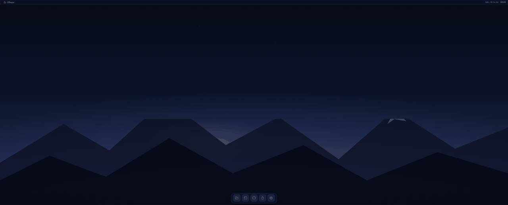

<div align="center">


# Olimpo

**A personal "operating system" for developer focus and organization.**

A macOS/Win11-style desktop shell with glassmorphism — windows, dock, Spotlight — running real apps inside: a native ConPTY terminal, a workspace file explorer, a pomodoro timer and a GitHub dashboard.

Tauri 2 (Rust) · React 19 + TypeScript · Windows 11

[Download installer](https://github.com/Jdmatta/olimpo/releases/latest) · [Leia em português](README.pt-BR.md)

</div>



## Apps

| App | What it actually does |
|---|---|
| **Terminal** | Real pwsh 7 / PowerShell / cmd over **ConPTY** (`portable-pty` + xterm.js); output streams through Tauri **Channels with raw payloads** — survives `Get-ChildItem -Recurse` without choking; zero orphaned `conhost` on close |
| **Files** | Workspace explorer: browse, create, rename, move (drag & drop), **delete to Recycle Bin only**, open in VS Code, "Open Terminal here" — scoped to allowed roots by a path guard |
| **Focus** | **Timestamp-based** pomodoro (survives an app restart mid-session) with study techniques (25/5, 52/17, 90/20) and a **long break every 4 cycles**, daily tasks with carry-over, an **immersive mode** that covers the whole desktop, native toasts, 14-day history |
| **App launcher** | Auto-detects installed browsers and editors (Brave, Chrome, Edge, Firefox, VS Code, Cursor, Zed) and lets you register any executable — launched from the dock or Spotlight, validated and spawned with argument lists |
| **Notes** | Glass post-its you drag around the desktop while studying (topic inherited from the focused task), then an app to edit them, turn any into a **flashcard**, run a shuffle **review**, and export a Markdown summary into the workspace |

Personalization (Settings › Appearance): accent color, glass density, reduced motion, and which apps open on boot. Auto-updates from GitHub Releases (signed). Draggable desktop icons.
| **GitHub** | Dashboard over the official API: repos, assigned issues/PRs, commits; the PAT lives in the **Windows Credential Manager** — never in a file, database or the frontend |
| **Settings** | Wallpapers (procedural presets or your own images), default shell, quick links, GitHub connection, autostart |

Shell: draggable/resizable windows with traffic lights, dock with magnification, menubar with a pomodoro chip, **Spotlight** (`Ctrl+Space`) with fuzzy search, edge snapping with preview, F11 true fullscreen.

## Architecture

```
React (WebView2) ── typed invoke surface (src/lib/ipc.ts, single entry point)
        │
   Tauri 2 (Rust) ─┬─ pty/      ConPTY via portable-pty; reader + waiter threads
                   ├─ fs/       path_guard: canonicalize + starts_with(allowed roots)
                   ├─ db/       rusqlite + user_version migrations
                   ├─ github/   reqwest + hand-written DTOs; 5-min TTL cache
                   └─ secrets/  keyring → Windows Credential Manager
```

Decisions worth reading:

- **Guaranteed glass**: the native window is opaque; the wallpaper and blur are DOM (`backdrop-filter`) — no dependency on Windows' flaky DWM acrylic.
- **Minimized windows stay mounted** (`inert` + animation): the terminal survives minimization with its session alive.
- **ConPTY EOF on Windows** only arrives after the master is dropped: a *waiter* thread reaps the process, drains with a quiescence window and only then closes — no lost output, no leaked console hosts.

## Security

- Every filesystem access goes through `path_guard.rs`: canonicalization (`dunce`), `starts_with` against allowed roots, Windows reserved names — tested against `..\..`, absolute paths and **junction escapes**.
- Deletion is always `trash::delete` (Recycle Bin). Processes spawn via `Command` + argument lists, never shell strings.
- GitHub PAT: entered once, validated, stored via `keyring`, and all API calls happen on the Rust side. Error messages **sanitize tokens**.
- 100% parameterized SQL behind a repository layer; strict CSP; minimal capabilities (opener restricted to `https://**`).

## Tests

`cargo test` (26) + `vitest` (40): path guard, real ConPTY (spawn/kill/exit), migrations, SQL repositories, pomodoro engine with an injected clock, window manager, Spotlight fuzzy matching, snap zones.

## Run

```powershell
npm install
npm run tauri dev      # first Rust build takes a few minutes
```

Prerequisites: Node 20+, Rust stable-msvc, VS Build Tools (C++), WebView2 (built into Win11).

Installer: `npm run tauri build` → NSIS at `src-tauri/target/release/bundle/nsis/`, or grab it from [Releases](https://github.com/Jdmatta/olimpo/releases). Unsigned build — SmartScreen will ask for "More info → Run anyway".

## Roadmap

v1.2: file watcher (`notify`), terminal tabs, configurable workspace root, restore from Recycle Bin.

## License

[MIT](LICENSE) — Jairo da Matta
