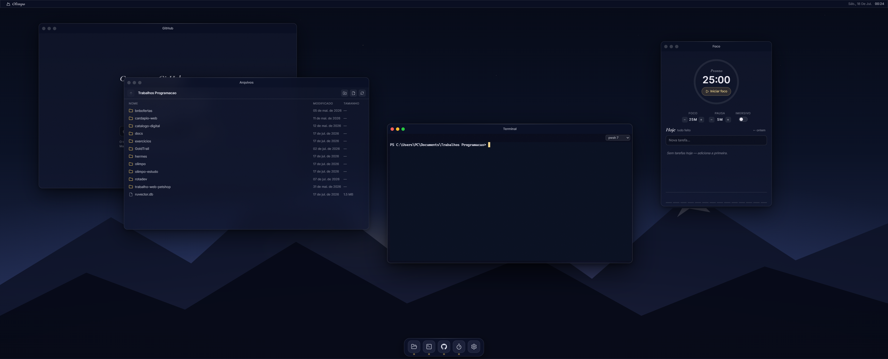

<div align="center">


# Olimpo

**Um "sistema operacional" pessoal para foco e organização no trabalho dev.**

Shell desktop estilo macOS/Win11 com glassmorfismo — janelas, dock, Spotlight — e apps de verdade por dentro: terminal ConPTY, explorer do workspace, pomodoro e dashboard do GitHub.

Tauri 2 (Rust) · React 19 + TypeScript · Windows 11

</div>



## Apps

| App | O que faz de verdade |
|---|---|
| **Terminal** | pwsh 7 / PowerShell / cmd reais via **ConPTY** (`portable-pty` + xterm.js); streaming por Tauri **Channels com payload raw** — aguenta `Get-ChildItem -Recurse` sem engasgar; zero `conhost` órfão ao fechar |
| **Arquivos** | Explorer do workspace: navegar, criar, renomear, mover (drag & drop), **deletar só para a Lixeira**, abrir no VS Code, "Abrir Terminal aqui" |
| **Foco** | Pomodoro por **timestamps** (sobrevive a restart no meio da sessão), tarefas do dia com carry-over, modo **imersivo** que cobre o desktop, toast nativo, histórico de 14 dias |
| **GitHub** | Dashboard via API oficial: repos, issues/PRs atribuídos, commits; PAT guardado no **Windows Credential Manager** — nunca em arquivo, banco ou frontend |
| **Ajustes** | Wallpaper (procedural ou imagens suas), shell padrão, quick links, conexão GitHub |

Shell: janelas arrastáveis/redimensionáveis com traffic lights, dock com magnify, menubar com chip do pomodoro, **Spotlight** (`Ctrl+Space`) com fuzzy search, snap de bordas com preview.

## Arquitetura

```
React (WebView2) ── invoke tipado (src/lib/ipc.ts, superfície única)
        │
   Tauri 2 (Rust) ─┬─ pty/      ConPTY via portable-pty; threads reader+waiter
                   ├─ fs/       path_guard: canonicalize + starts_with(root)
                   ├─ db/       rusqlite + migrations por user_version
                   ├─ github/   reqwest + DTOs; cache TTL 5 min
                   └─ secrets/  keyring → Windows Credential Manager
```

Decisões que valem leitura:

- **Vidro garantido**: janela nativa opaca; wallpaper e blur são DOM (`backdrop-filter`) — sem depender do acrílico instável do DWM.
- **Janelas minimizadas continuam montadas** (`inert` + animação): o xterm sobrevive minimizado com a sessão viva.
- **EOF do ConPTY no Windows** só chega depois de dropar o master: thread *waiter* espera o processo, drena com quiescência e só então fecha — sem perder output, sem vazar console host.

## Segurança

- Todo acesso a arquivo passa por `path_guard.rs`: canonicalização (`dunce`), `starts_with(root)`, nomes reservados do Windows — testado contra `..\..`, caminho absoluto e **escape por junction**.
- Delete é sempre `trash::delete` (Lixeira). Processos só com `Command` + lista de argumentos.
- PAT do GitHub: entra uma vez, é validado, vai pro Credential Manager via `keyring` e as chamadas saem do lado Rust. Mensagens de erro **sanitizam tokens**.
- SQL 100% parametrizado numa camada de repositório; CSP restritiva; capabilities mínimas (opener limitado a `https://**`).

## Testes

`cargo test` (25) + `vitest` (39): guard de caminhos, ConPTY real (spawn/kill/exit), migrations, repos SQL, engine do pomodoro com clock injetado, window manager, fuzzy do Spotlight, zonas de snap.

## Rodar

```powershell
npm install
npm run tauri dev      # primeira compilação Rust demora alguns minutos
```

Pré-requisitos: Node 20+, Rust stable-msvc, VS Build Tools (C++), WebView2 (nativo no Win11).

Instalador: `npm run tauri build` → NSIS em `src-tauri/target/release/bundle/nsis/`. Sem assinatura de código — o SmartScreen vai pedir "Mais informações → Executar assim mesmo".

## Roadmap

v1.1: watcher de arquivos (`notify`), abas no terminal, troca de raiz do workspace, restaurar da Lixeira, autostart.

## Licença

[MIT](LICENSE) — Jairo da Matta
